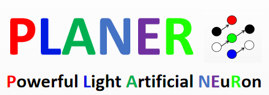
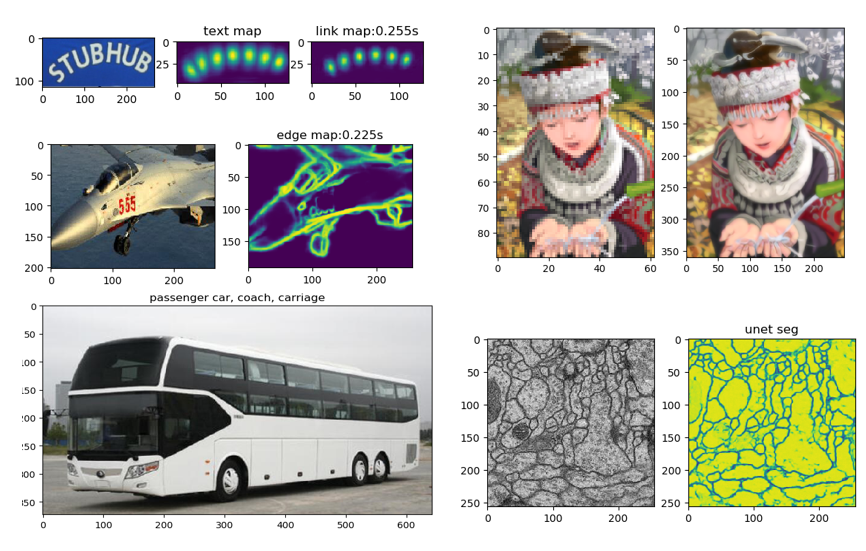

## Planer: Powerful Light Artificial NEuRon



A powerful light-weight inference framework for CNN. The aim of planer is to provide efficient and adaptable inference environment for CNN model. Also in order to enlarge the application scope, we support ONNX format, which enables the converting of trained model within various DL frameworks.  

## Features

Planer is a light-weight CNN framework implemented in pure Numpy-like interface. It can run only with Numpy. Or change different backends. (Cupy accelerated with CUDA, ClPy accelerated with OpenCL).

* Implemented in pure Numpy-like interface. 
* Extremely streamlined IR based on json
* Powerful model visualization tools
* ONNX supported model converting
* Plenty of inspiring demos

## Various Building Options
All the elements (layers, operations, activation fuctions) are abstracted to be ```layer```, and a json formatted ```flow``` is applied to build the computation graph. We support 3 ways of building a network:
* PyTorch-like
```python
from planer import *
# ========== write a net manually ========== 
class CustomNet(Net):
    def __init__(self):
        self.conv = Conv2d(3, 64, 3, 1)
        self.relu = ReLU()
        self.pool = Maxpool(2)
        self.upsample = UpSample(2)
        self.concatenate = Concatenate()
        self.sigmoid = Sigmoid()

    def forward(self, x):
        x = self.conv(x)
        x = self.relu(x)
        y = self.pool(x)
        y = self.upsample(y)
        z = self.concatenate([x, y])
        return self.sigmoid(z)
```
* Json-like (based on our IR)
```python
# ========== load net from json ========== 
layer = [('conv', 'conv', (3, 64, 3, 1)),
        ('relu', 'relu', None),
        ('pool', 'maxpool', (2,)),
        ('up', 'upsample', (2,)),
        ('concat', 'concat', None),
        ('sigmoid', 'sigmoid', None)]

flow = [('x', ['conv', 'relu'], 'x'),
        ('x', ['pool', 'up'], 'y'),
        (['x','y'], ['concat', 'sigmoid'], 'z')]

net = Net()
net.load_json(layer, flow)
```

## Converted from onnx (pytorch 1.1.0)

It is easy to convert a net from torch after training (through onnx). Here is a demo with resnet18.

``` python
from torchvision.models import resnet18
import torch
from planer import torch2planer

net = resnet18(pretrained=True)
x = torch.randn(1, 3, 224, 224, device='cpu')
torch2planer(net, 'resnet18', x)

# then you will get a resnet18.json and resnet18.npy in current folder.

from planer import read_net
import planer
import numpy as np

# get the planer array lib
pal = planer.core(np)
x = pal.random.randn(1, 3, 224, 224).astype('float32')
net = read_net('resnet18')
net(x) # use the net to predict youre data
```

## Change backend

Planer is based on Numpy-like interface. So it is easy to change backend to Cupy or ClPy. 

```python
import planer, cupy
planer.core(cupy) # use cupy as backend

import planer, clpy
planer.core(clpy) # use clpy as backend
```

We tested on windows, planer with cupy is 80-100 times faster then numpy. has a equal performance with torch. (but on linux torch is faster)

## Network visualization

We provide a powerful visualization tools for the cnn model. Just call ```net.show()``` will work.


## Demos
We have released some demos, which can be investigated inside ```demo/``` folder.



## Planer-pro

Planer is our open source version framework, We also have a professional version. (several times faster then torch)
